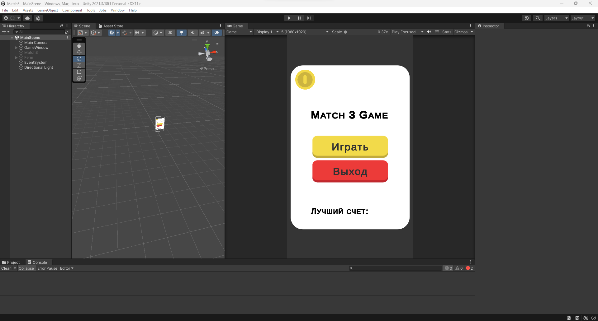
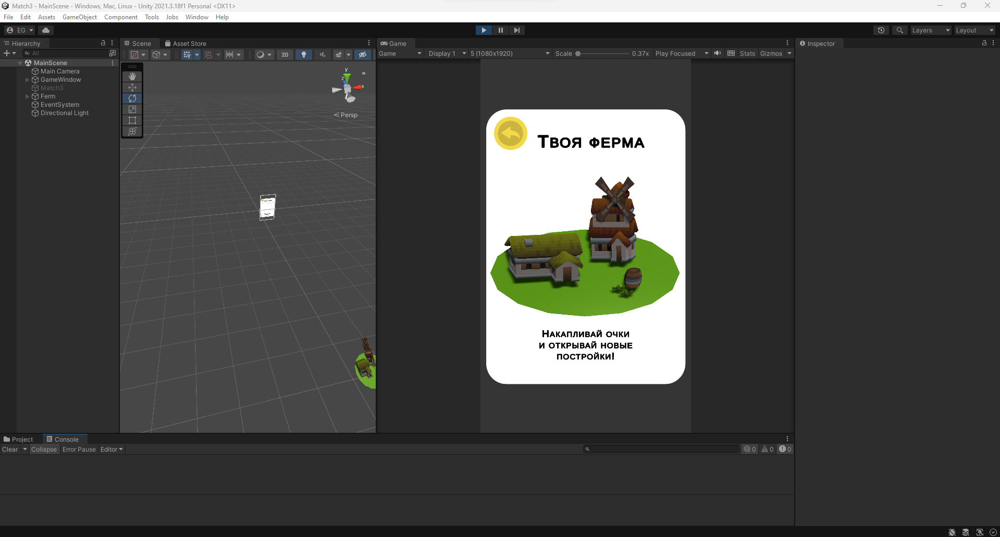
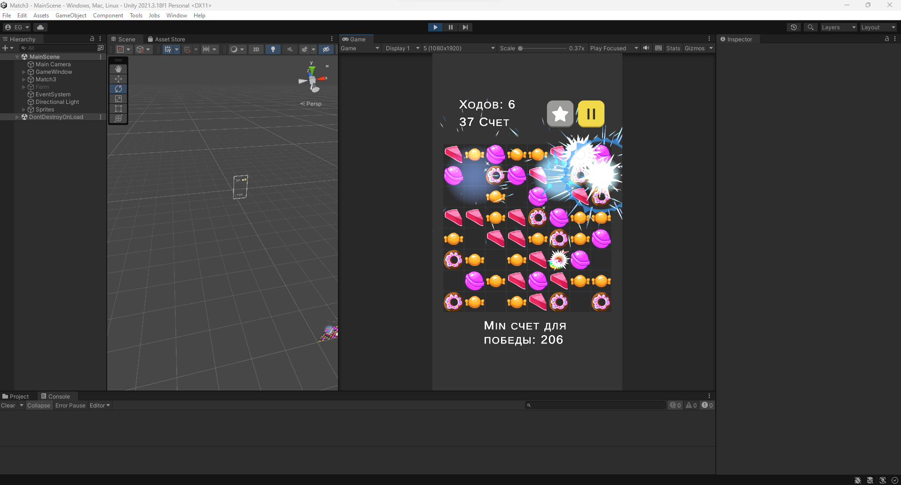
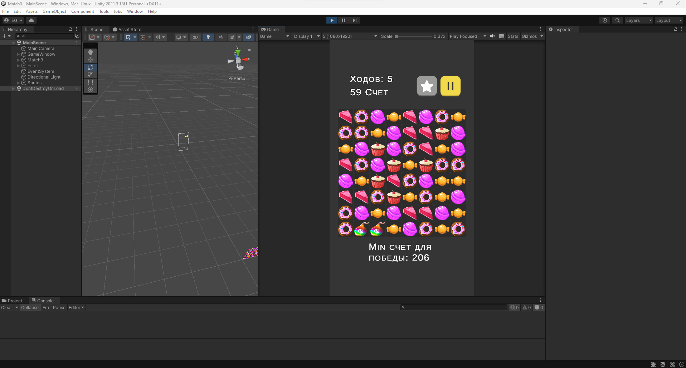
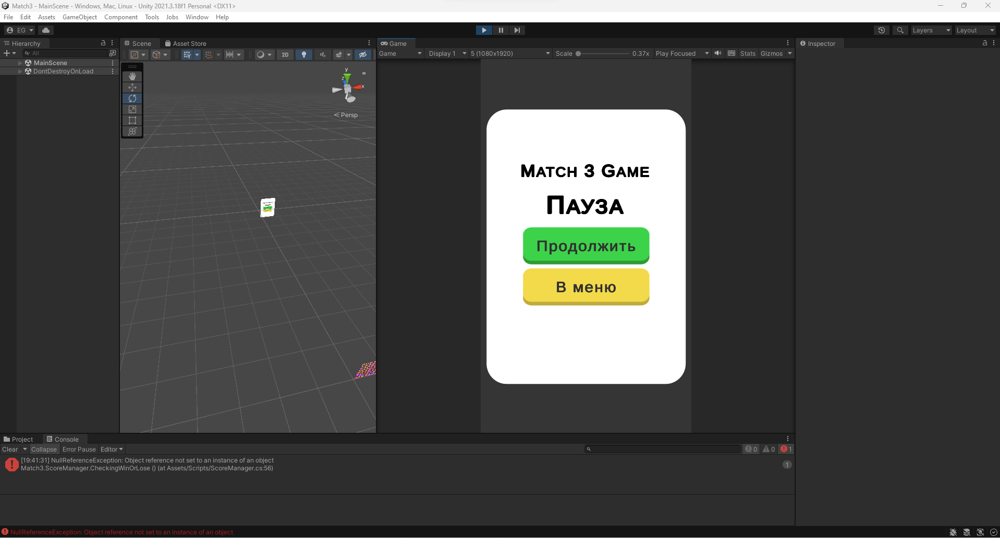

# Match3_Game
Классическая гиперказуальная игра три-в-ряд.
Unity 2021.3.18
Особенности:
Основной цикл игры: 
- Защита от дедлока (отсутствие ходов);
- Подсказка варианта при длительном простое (40+ секунд);
- 5 разных цветов игровых фишек;
- 64 клетки на игровом поле;
- Аккумуляция очков за уничтоженные фишки;
- Добавлены визуальные (VFX), звуковые эффекты (SFX).
Бонусы за длинные цепочки, магический камни:
- Взрыв, уничтожающий дополнительные фишки;
- Уничтожение всех одноцветных фишек;
- Уничтожение фишек в ряд/колонну;
- Дополнительные ходы, при достижении счета в 100 очков (+4).
Реализован допольнительный игровой цикл (мини-игра):
- Строительсво фермы при достижении 50, 120, 200 очков.

<table>
    <tr>
        <td>
            
        </td>
    </tr>
    <tr>
        <td>
            
        </td>
    </tr>
    <tr>
        <td>
            
        </td>
    </tr>
    <tr>
        <td>
            
        </td>
    </tr>
	<tr>
        <td>
            
        </td>
    </tr>
</table> 
